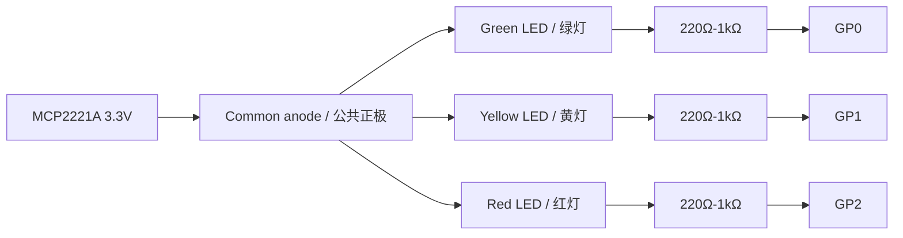

# Vibecoding Signal Light

> A real traffic light for AI agents.  
> 给 AI Agent 一个看得见的状态灯。

Vibecoding Signal Light turns a small red/yellow/green traffic signal model into an ambient status display for Codex, Claude Code, and other local AI coding agents. When the agent is working, waiting, blocked, or asking for permission, the light on your desk changes with it.

It is deliberately simple: glance at the lamp, know whether you should keep flowing or look back at your agent.

Vibecoding Signal Light 把一个红、黄、绿三色交通信号灯模型变成 AI 编程助手的实体状态面板。Codex、Claude Code 或其他本地 Agent 开始工作、请求权限、遇到阻塞时，桌上的信号灯会同步变化。

它的目标不是炫技，而是让 AI Agent 从屏幕里的文字流，变成房间里能被一眼感知的工作伙伴。

## Demo / 示例


The reference build mounted beside a laptop, showing the steady green idle state.

参考实物安装在笔记本旁边，图中是绿灯常亮的空闲状态。

## Why This Exists / 为什么做这个

AI coding agents are getting more autonomous, but their state is still trapped inside a terminal or chat window. That creates two awkward modes:

- You keep checking the agent too often and break your own focus.
- You forget it is waiting for permission, a result review, or a failure recovery.

This project gives the agent a physical presence:

- Green means you can relax.
- A slow three-color cycle means the agent is busy.
- Yellow means the agent explicitly needs a look.
- Red means stop what you are doing and unblock it.

AI 编程助手越来越能自己跑命令、改文件、开子任务，但它的状态通常还困在终端或聊天窗口里。于是你要么反复切回去看，打断自己的注意力；要么忘了它正在等权限、等你读结果、或者已经失败。

这个项目给 Agent 一个真实存在的环境信号：

- 绿灯：没事，继续你的事。
- 绿黄红慢速循环：Agent 正在工作。
- 黄闪：Agent 明确需要你看一眼或继续。
- 红闪：需要马上处理，通常是权限、阻塞或失败。

## Hardware / 硬件

The current reference build uses:

| Part | Description |
| --- | --- |
| MCP2221A USB GPIO adapter | Drives the traffic light from a Mac/Linux machine over USB |
| 3-light traffic signal model | Red, yellow, and green LEDs or lamp modules |
| Python + EasyMCP2221 | Local GPIO control, no network service required |

当前参考硬件：

| 硬件 | 说明 |
| --- | --- |
| MCP2221A USB GPIO 转接板 | 通过 USB 从电脑控制 GPIO |
| 三色交通信号灯模型 | 红、黄、绿三路 LED 或灯模块 |
| Python + EasyMCP2221 | 本地控制 GPIO，不需要额外云服务 |

Default wiring is active-low:

| Signal | MCP2221A pin | Meaning |
| --- | --- | --- |
| Green | `gp0` | Idle |
| Yellow | `gp1` | Attention |
| Red | `gp2` | Permission, blocked, or failed |
| Active level | GPIO `LOW` | Light on |

默认接线是低电平点亮：

| 灯 | MCP2221A 引脚 | 含义 |
| --- | --- | --- |
| 绿灯 | `gp0` | 空闲 |
| 黄灯 | `gp1` | 需要关注 |
| 红灯 | `gp2` | 权限、阻塞或失败 |
| 有效电平 | GPIO `LOW` | 灯亮 |

### Wiring / 接线

The reference build uses a common-anode, active-low LED-style wiring. Each light has its own current-limiting resistor unless your traffic light module already includes one.

参考实物使用公共正极、低电平点亮的 LED 接法。每一路灯都应该串联独立限流电阻，除非你的交通灯模块已经内置电阻。

```text
MCP2221A 3.3V  ────────────────┬── Green LED anode / 绿灯正极
                               ├── Yellow LED anode / 黄灯正极
                               └── Red LED anode / 红灯正极

Green LED cathode / 绿灯负极   ── 220Ω-1kΩ ── GP0
Yellow LED cathode / 黄灯负极  ── 220Ω-1kΩ ── GP1
Red LED cathode / 红灯负极     ── 220Ω-1kΩ ── GP2
```



In this mode, the MCP2221A GPIO pin sinks current:

- GPIO `HIGH`: light off
- GPIO `LOW`: light on

这种模式下 MCP2221A GPIO 负责下拉电流：

- GPIO `HIGH`：灯灭
- GPIO `LOW`：灯亮

If your signal model is common-cathode or active-high, wire each GPIO through a resistor to the LED anode, connect the cathodes to `GND`, and set:

```bash
export SIGNAL_LIGHT_ACTIVE_LOW=0
```

如果你的灯是公共负极或高电平点亮，则应让每个 GPIO 通过限流电阻接到对应 LED 正极，LED 负极接 `GND`，并设置：

```bash
export SIGNAL_LIGHT_ACTIVE_LOW=0
```

Important: MCP2221A GPIO pins are for small LED loads only. If your traffic light uses 5V/12V lamps, LED strips, relays, or anything above the GPIO current limit, use a transistor, MOSFET, relay module, or dedicated LED driver between the MCP2221A and the light.

注意：MCP2221A GPIO 只适合直接驱动小电流 LED。若你的信号灯是 5V/12V 灯组、灯带、继电器，或电流超过 GPIO 能力，请在 MCP2221A 和灯之间增加三极管、MOSFET、继电器模块或专用 LED 驱动。

You can override the wiring:

```bash
export SIGNAL_LIGHT_GREEN_PIN=gp0
export SIGNAL_LIGHT_YELLOW_PIN=gp1
export SIGNAL_LIGHT_RED_PIN=gp2
export SIGNAL_LIGHT_ACTIVE_LOW=1
```

Set `SIGNAL_LIGHT_ACTIVE_LOW=0` if your traffic light is wired active-high.

## Lamp Language / 灯语

The language is intentionally small and persistent. The current light should always describe the current state.

灯语刻意保持简单，并且状态会持续显示。你不需要记复杂动画，只要看当前灯效。

| Light / 灯效 | Agent state / Agent 状态 | Human action / 你该做什么 |
| --- | --- | --- |
| Steady green / 绿灯常亮 | Idle / 空闲 | Nothing / 不用管 |
| Slow green-yellow-red cycle / 绿黄红慢速循环 | Working / 正在思考、跑工具、改文件或测试 | Wait / 等它跑 |
| Flashing yellow / 黄灯闪烁 | Explicit attention / 明确需要你读结果或继续 | Look when convenient / 有空看一眼 |
| Flashing red / 红灯闪烁 | Permission, blocked, or failed / 需要权限、阻塞或失败 | Look now / 马上处理 |
| Off / 全灭 | Manual clear / 手动清除 | Nothing / 不用管 |

The work cycle avoids software PWM on plain GPIO hardware, because USB GPIO timing can create visible flicker. On the MCP2221A reference build, the work state is a calm, slow three-color cycle. If you later add a driver that supports real brightness control, the same pattern can be rendered as a soft pulse.

当前 MCP2221A GPIO 参考实现不会用软件 PWM 模拟呼吸灯，因为 USB GPIO 的时序抖动会造成肉眼可见的频闪。工作态默认是安静的三色慢速循环。如果未来换成真正支持亮度控制的驱动，同一套模式可以渲染成柔和脉冲。

## Features / 功能亮点

- Physical ambient status for AI agents.
- Codex hook adapter.
- Claude Code hook adapter.
- Session-aware aggregation for multiple concurrent agent sessions.
- Red and yellow alerts are never hidden by another session starting work.
- Background worker keeps animations persistent while hooks return quickly.
- Dry-run mode for testing without hardware.
- Environment-based GPIO mapping for custom builds.

- 给 AI Agent 一个实体环境状态灯。
- 支持 Codex hook。
- 支持 Claude Code hook。
- 支持多个 Agent 会话并发时的状态聚合。
- 红灯/黄灯告警不会被另一个会话的工作态覆盖。
- 后台 worker 保持灯效持续运行，hook 本身快速返回。
- 支持无硬件 dry-run 预览。
- 支持通过环境变量调整 GPIO 接线。

## Quick Start / 快速开始

Install dependencies with your preferred Python workflow. With `uv`:

```bash
uv sync
```

List the signal language:

```bash
./scripts/signal-light list
```

Preview without hardware:

```bash
./scripts/signal-light play working --dry-run
./scripts/signal-light play attention --dry-run
./scripts/signal-light play permission --dry-run
```

Run a wiring test on the real MCP2221A setup:

```bash
./scripts/signal-light test
```

Play real signals:

```bash
./scripts/signal-light play working
./scripts/signal-light play permission
./scripts/signal-light play idle
```

The wrapper scripts avoid writing `__pycache__` files in the repository. By default they use `.venv/bin/python` when it exists, then fall back to `python3`. If you want wrappers to run through `uv`, set:

```bash
export SIGNAL_LIGHT_USE_UV=1
```

## Codex Integration / Codex 集成

Codex hooks can call the wrapper with the event name:

```bash
./scripts/codex-signal-hook UserPromptSubmit
./scripts/codex-signal-hook PreToolUse
./scripts/codex-signal-hook PermissionRequest
./scripts/codex-signal-hook Stop
```

Recommended hook mapping:

| Codex event | Signal behavior |
| --- | --- |
| `SessionStart` | Green idle |
| `UserPromptSubmit` | Working cycle |
| `PreToolUse` | Working cycle |
| `PostToolUse` | Working cycle |
| `PermissionRequest` | Red flashing |
| `Stop` | Clear normal working state |
| `SessionEnd` | Brief green completion blink, then current aggregate state |

See [docs/LAMP_LANGUAGE.md](docs/LAMP_LANGUAGE.md) for a complete `~/.codex/hooks.json` example.

Codex hook 可以直接把事件名传给 wrapper：

```bash
./scripts/codex-signal-hook UserPromptSubmit
./scripts/codex-signal-hook PreToolUse
./scripts/codex-signal-hook PermissionRequest
./scripts/codex-signal-hook Stop
```

推荐映射：

| Codex 事件 | 灯效行为 |
| --- | --- |
| `SessionStart` | 绿灯空闲 |
| `UserPromptSubmit` | 工作循环 |
| `PreToolUse` | 工作循环 |
| `PostToolUse` | 工作循环 |
| `PermissionRequest` | 红灯闪烁 |
| `Stop` | 清理普通工作态 |
| `SessionEnd` | 绿灯短闪提示完成，然后恢复当前聚合状态 |

完整 `~/.codex/hooks.json` 示例见 [docs/LAMP_LANGUAGE.md](docs/LAMP_LANGUAGE.md)。

## Claude Code Integration / Claude Code 集成

Claude Code sends hook data as JSON on stdin, so the wrapper usually needs no event argument:

```bash
echo '{"event":"PreToolUse","session_id":"demo"}' | ./scripts/claude-code-signal-hook
echo '{"event":"PermissionRequest","session_id":"demo"}' | ./scripts/claude-code-signal-hook
echo '{"event":"Notification","session_id":"demo"}' | ./scripts/claude-code-signal-hook
```

Supported Claude Code events include:

| Claude Code event | Signal behavior |
| --- | --- |
| `SessionStart` | Green idle |
| `UserPromptSubmit` | Working cycle |
| `PreToolUse` | Working cycle |
| `PostToolUse` | Working cycle |
| `PostToolUseFailure` | Red flashing |
| `Notification` | Yellow flashing |
| `PermissionRequest` | Red flashing |
| `Stop` | Clear normal working state |
| `SessionEnd` | Brief green completion blink, then current aggregate state |

Claude Code 会通过 stdin 传入 JSON hook 数据，因此 wrapper 通常不需要额外参数：

```bash
echo '{"event":"PreToolUse","session_id":"demo"}' | ./scripts/claude-code-signal-hook
echo '{"event":"PermissionRequest","session_id":"demo"}' | ./scripts/claude-code-signal-hook
echo '{"event":"Notification","session_id":"demo"}' | ./scripts/claude-code-signal-hook
```

支持的 Claude Code 事件包括：

| Claude Code 事件 | 灯效行为 |
| --- | --- |
| `SessionStart` | 绿灯空闲 |
| `UserPromptSubmit` | 工作循环 |
| `PreToolUse` | 工作循环 |
| `PostToolUse` | 工作循环 |
| `PostToolUseFailure` | 红灯闪烁 |
| `Notification` | 黄灯闪烁 |
| `PermissionRequest` | 红灯闪烁 |
| `Stop` | 清理普通工作态 |
| `SessionEnd` | 绿灯短闪提示完成，然后恢复当前聚合状态 |

See [docs/LAMP_LANGUAGE.md](docs/LAMP_LANGUAGE.md) for a complete `~/.claude/settings.json` example.

完整 `~/.claude/settings.json` 示例见 [docs/LAMP_LANGUAGE.md](docs/LAMP_LANGUAGE.md)。

## Multi-Session Behavior / 多会话行为

The runtime stores the latest state for each agent session and shows the highest-priority aggregate on the physical light:

```text
red flashing > yellow flashing > working cycle > steady green
```

That means one session waiting for permission will stay red even if another session starts working. A normal `Stop` only clears non-urgent working state; it does not erase an existing red alert.

When one tracked session ends while other sessions are still running, the runtime briefly flashes green as a completion cue, then restores the current aggregate state. If all sessions have ended, it settles on steady green. Red or yellow alerts are not interrupted by this completion cue.

运行时会记录每个 Agent 会话的最新状态，并把最高优先级状态显示到真实信号灯上：

```text
红灯闪烁 > 黄灯闪烁 > 工作循环 > 绿灯常亮
```

因此，一个会话正在等待权限时，即使另一个会话开始工作，红灯也不会被覆盖。普通 `Stop` 只会清掉非紧急的工作态，不会误清除已有红灯告警。

当某个已记录的会话结束、但其它会话还在运行时，运行时会让绿灯短暂闪烁，提示“有一个会话完成了”，然后恢复当前聚合状态。如果所有会话都结束了，最终会回到绿灯常亮。红灯或黄灯告警不会被这个完成提示打断。

## Project Status / 项目状态

This is a small, hackable hardware companion for AI-assisted development. It is designed to be easy to fork, rewire, and adapt:

- Swap MCP2221A for another GPIO backend.
- Add true PWM or LED strip drivers.
- Map other agent systems into the same lamp language.
- Build a nicer enclosure and put it on your desk.

这是一个小而可改的 AI 编程硬件伴侣项目。你可以很容易地 fork 并扩展它：

- 把 MCP2221A 换成其他 GPIO 后端。
- 增加真正的 PWM 或灯带驱动。
- 把更多 Agent 系统映射到同一套灯语。
- 做一个更漂亮的外壳，把它放到桌面上。

If your AI agent has become part of your workflow, give it a signal light.

如果 AI Agent 已经成了你的工作流的一部分，给它一盏真正的状态灯。
